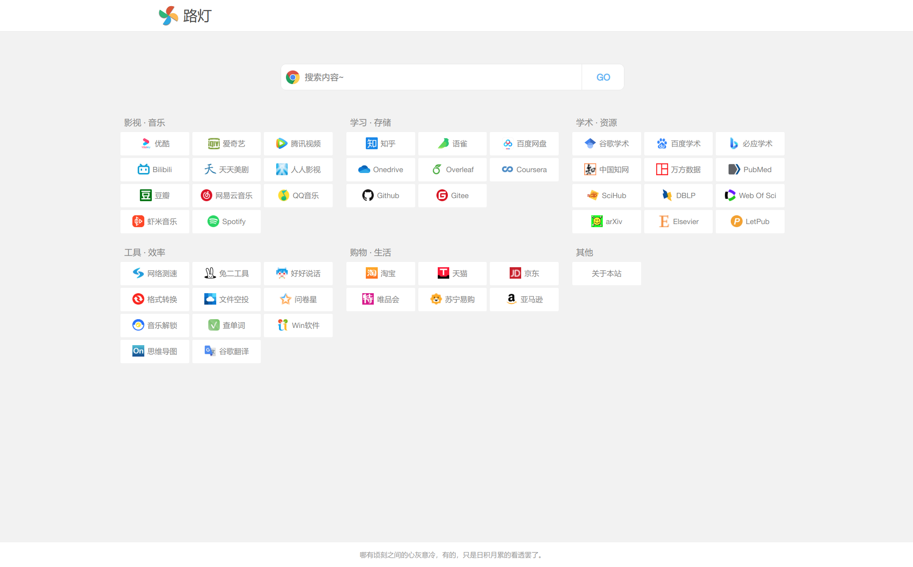

# 路灯 —— 一个极简导航页

包含了以下模块:
* 影视音乐网站
* 学习存储网站
* 学术资源网站
* 工具效率网站
* 购物生活网站
* 合集收藏网站
* 其他

包含多种搜索引擎:
* 百度
* 谷歌
* 必应
* 知乎
* 有道
* B站
* Github

## 版本

* 浙大版 (包含浙大常用链接和更多编程相关链接): https://nav.jarvis73.com/ 源码在 [mine](https://github.com/Jarvis73/navigator/tree/mine) 分支
* 简化版 (仅包含通用工具): https://ludeng.jarvis73.com/ 源码在 [master](https://github.com/Jarvis73/navigator) 分支

## 更新日志

* **2020-12-24:** 增加了影音资源,编程资源和工具资源页面
* **2020-10-29:** 增加了谷歌/百度/必应的搜索建议.

## Acknowledgement

感谢 [xiaodai945](https://github.com/xiaodai945/WEBJIKE) 提供的原始模板

感谢 [张一](https://zjuers.com/) 的首页简化方案
